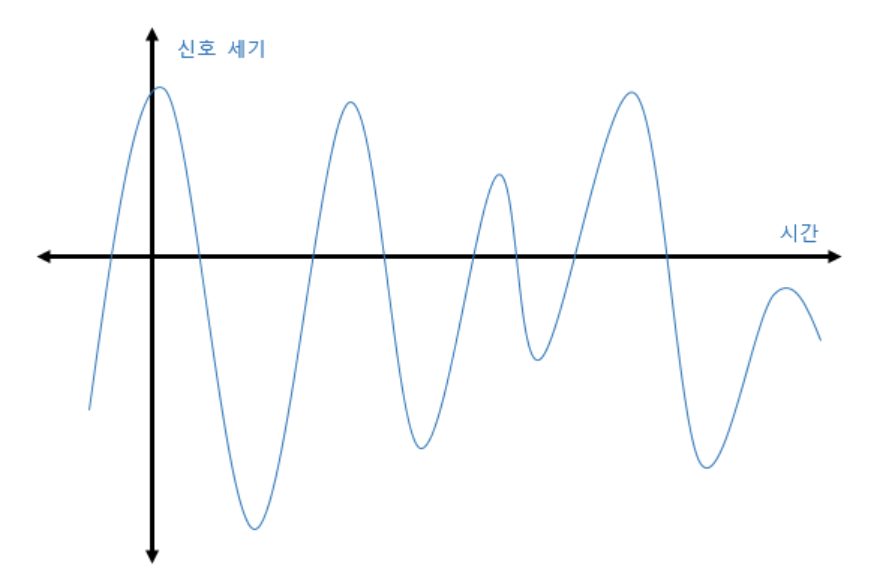

# 라즈베리파이에서 사운드 사용하기

[출처](https://m.blog.naver.com/tipsware/220868928930)  *개인 공부를 위해 이 포스팅을 참고하여 정리한 글입니다*

​     

## 1. 필요한 장비

라즈베리파이는 기본적으로 사운드 출력만 가능하다. 따라서 사운드 출력만 필요하다면 추가적인 하드웨어가 필요 없다. 하지만, 마이크를 사용해서 사운드 입력을 해야 하는 상황이라면 라즈베리파이의 기본 구성으로는 불가능하기 때문에 USB 형식의 사운드 카드를 구입해 라즈베리파이에 설치해야 한다.

사운드 입력을 위한 마이크

사운드 출력을 위한 스피커

​    

## 2. 사운드 입출력을 사용하기 위한 라이브러리 설치

라즈베리파이에서 사운드 입출력 프로그래밍을 하려면 사운드 관련 라이브러리를 설치해야 한다.

먼저, 혹시 모를 업데이트를 반영하기 위해 라즈베리파이 업데이트와 업그레이드를 아래와 같은 명령어를 사용하여 진행한다.

```tex
sudo apt-get update
sudo apt-get upgrade
```

그리고 나서 유닉스와 리눅스 환경에서 사운드 입출력시에 많이 이용하는 ALSA 라이브러리를 아래와 같은 명령어를 사용해 설치한다.

```python
sudo apt-get install alsa-utils #사운드 설정을 위해 필요한 것들이 설치됨
sudo apt-get install libasound2-dev #사운드 관련 프로그램 개발에 필요한 라이브러리 설치
```

​     

## 3. USB형식의 사운드 카드 연결 (사운드 입력을 사용하는 경우)

라즈베리파이에 사운드 카드를 연결하고, 사운드 카드가 라즈베리파이에 잘 설치되었는지 소프트웨어적으로 확인해야 한다.

. . .(이하 생략)

​    

## 4. ALSA 라이브러리에서 사운드 장치 이름 구성하기

"plughw:카드번호,장치번호"를 사운드 카드 이름으로 사용하면 된다.

​    

## 5. 사운드 카드의 입출력 속성

**샘플링 작업**

- **샘플링**

  샘플링이라는 것은 <펄스 형태의 아날로그 신호>를 <디지털화된 정수값>으로 변경하는 작업.

  

  위 신호를 디지털 신호로 변경하면 -60, -30, 12, 42, 63, ...와 같이 숫자값으로 변경되어야 한다는 뜻.

  사운드 카드는 이 작업을 아래와 같이 일정한 시간 간격으로 신호 세기를 추출하여 처리하는데 이것을 '샘플링'이라고 한다.

  ​    

- **샘플링 주기**

  사운드 카드에서는 1초당 몇번이나 샘플링 할것인지 프로그래머가 정할 수 있는데, 이것이 '샘플링 주기(frequency)'이다. 예를 들어 샘플링 주기가 8KHz라고 하면 1초 동안 8000번의 샘플링 데이터를 추출한다는 뜻이다. 따라서 샘플링 주기가 높으면 높을수록 디지털화된 데이터는 더욱더 정밀하게 표현된다.

  

  ​    

- **샘플링 레이트**

  샘플링 시에 샘플링 될 값의 범위를 지정하는 것을 '샘플링 레이트'라고 하며 이 값이 커지면 커질수록 더 정밀하게 데이터를 추출할 수 있다.
  
  동일한 신호라고 하더라도 샘플링을 할때 상한선과 하한선을 다르게 하면 샘플링 주기가 동일하더라도 샘플링 된 값이 달라지게 된다. 상한선과 하한선의 범위를 두 배로 크게 지정하면 샘플링되는 값도 두 배로 증가한다는 뜻이다.
  
  

*샘플링 주기와 샘플링 레이트는 저장 공간을 고려해야 하기 때문에 무조건 크게 설정하는 것이 아니라 자신이 원하는 작업에 맞게 잘 조절해서 사용하는 것이 좋다.

.

.

.

(이하 생략)

그래서 샘플링 레이트 수를 바꿔주니 왜 오류가 해결됐는지 잘 생각해보고 연결지어보기!
