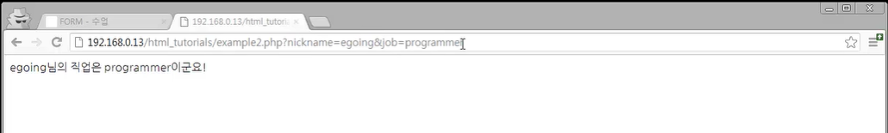
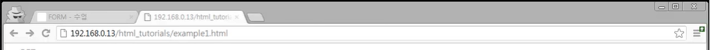

## GET과 POST

​    

하나의 웹페이지 안에는 여러 개의 form이 들어올 수 있음.

그 각각의 폼은 독립적으로 데이터를 전송한다

###### form이란 사용자가 입력한 정보를 받아서 서버로 전송하기 위한 HTML의 태그이다. 사용자가 입력한 정보를 받는 UI를 입력 컨트롤이라고 하는데 위의 코드에는 id와 password를 입력 받는 입력 컨트롤이 포함되어 있다. 입력 컨트롤에 입력된 정보는 해당 컨트롤의 속성 name의 값을 이름으로 데이터가 서버로 전송된다.

###### 정보 입력을 마치면 사용자가 입력한 정보를 서버로 전송할 수 있도록 해야하는데 그 때 사용하는 컨트롤이 submit 버튼이다. 사용자가 submit 버튼을 누르면 입력 컨트롤에 입력된 정보는 form 태그의 action 속성에 지정된 URL로 전송된다. 이 때 method에 지정된 방식에 따라서 get/post 방식으로 데이터가 전송된다. 위에서 살펴본 URL에 데이터를 첨부해서 전송하는 방식을 GET 방식이라고 부르고, POST 방식은 HTTP 메시지의 본문에 데이터를 포함해서 전송한다.

​    

메소드의 속성으로서 post와 get이 온다.

method="GET" / method="POST" 

(get, post 방식 모두 값을 전송하는 맥락은 같음)

---

### GET

url을 통해서 데이터를 전송하는 방식-> GET방식

url에 데이터 정보가 다 표시됨 

[예] url/ nickname=egoing&job=programmer&age=12

(url뒤의 값들은 ''파라미터'')

즉, 서버에는 다음과 같은 데이터가 전송되는 것이다. 

nickname=egoing, job=programmer, age=12

 #

### POST

POST의 경우 url은 바뀌지 않는다. (서버에 값이 전달된다는 맥락은 둘 다 같음)

[확인]

클라이언트가 서버로 보낼때의 데이터를 살펴보면 (아래를 확인), 그 안에 <전송값: 이름, 직업>이 보내진 것을 확인할 수 있음.

(*개발자 도구에서의 ''네트워크'' Tab : 서버와 클라이언트가 주고받는 데이터를 열람할 수 있도록 도와주는 도구)

---

즉 <둘의 차이 정리>

**GET방식은 URL을 통해서 전달하는 것**, 

**POST방식은 헤더라고 하는 데이터 안에 바디로 포함시켜서 전달하는 방식**

​    

- **GET**

  URL에 정보가 담겨서 전송된다.

  전송할 수 있는 정보의 길이가 제한되어 있다.

  퍼머링크로 사용될 수 있다.

- **POST**

  header의 body에 담겨서 전송된다.

  url상에 전달한 정보가 표시되지 않는다.

  GET에 비해 보안상 약간의 우외가 있다. (사실상 동일하다) (암호화를 하지 않는 이상 고만고만)

  전송할 수 있는 데이터의 길이 제한이 없다

  퍼머링크로 사용할 수 없다

  서버의 값이나 상태를 **변경/수정**하기 위해서 또는 **추가 or 삭제**하기 위해서 사용된다.

​    

*조금 더 이해를 돕기 위해...

우선 GET 은 가져오는 것이다. 서버에서 어떤 데이터를 가져와서 보여준다거나 하는 용도이지 서버의 값이나 상태 등을 변경하지 않는다. SELECT 적인 성향을 갖고 있다고 볼 수 있는 것이다. / 반면에 POST 는 서버의 값이나 상태를 변경하기 위해서 또는 추가하기 위해서 사용된다.

= GET요청은 서버에 존재하는 정보를 요청한다. 이 때 반환되는 정보는 정보 자체가 아니라 정보의 표현 / 반면에 POST요청은 서버에 정보를 생성하는 것을 요청한다. 

---