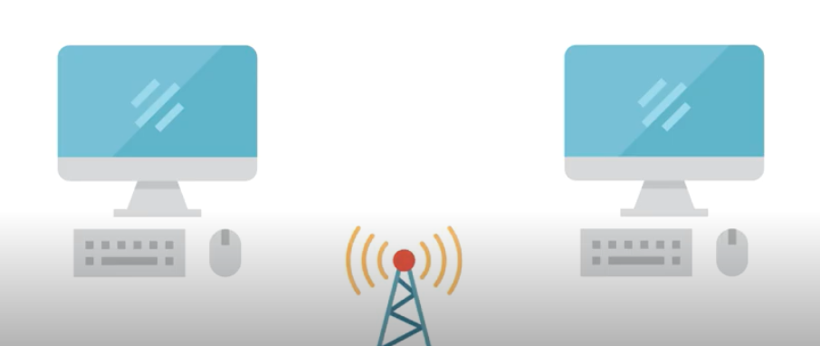

(무선/유선을 통한 매체 간의 통신)

#

**두 개의 시스템이 통신하기 위해서 그 일련의 절차들을 7단계로 나눔**

👇🏻

## OSI 7계층

: 네트워크를 구상할 때 이를 참조해서 만들어라 하는 참조모델 (7단계로 나눠놓음)

네트워크 분야에서 가장 중요하게 다루는 것으로써 세계적으로 사용이 되고 있는 **네트워크 표준 모델**. 이 안에 tcp/ip 및 네트워크 통신에 사용되는 전반적인 프로토콜이 모두 포함되어 있음.

([출처](https://www.youtube.com/watch?v=oKM_vbqDGJ0))

---

### OSI7계층과 그 존재 이유, TCP/IP 4계층에 대해 설명해보세요.

OSI7계층은 네트워크 통신을 구성하는 요소들 7개의 계층으로 표준화 한 것입니다. 이렇게 표준화하는 것의 장점은 통신이 일어나는 과정을 단계별로 파악할 수 있어, 문제가 발생하면 해당 문제를 해결하기 용이해집니다.

실제로 우리가 대부분 사용하는 네트워크는 TCP/IP 4계층입니다. 통신에 실제로 사용되는 계층이고 1,2 계층이 1계층, 5, 6, 7계층이 4계층으로 운영됩니다.